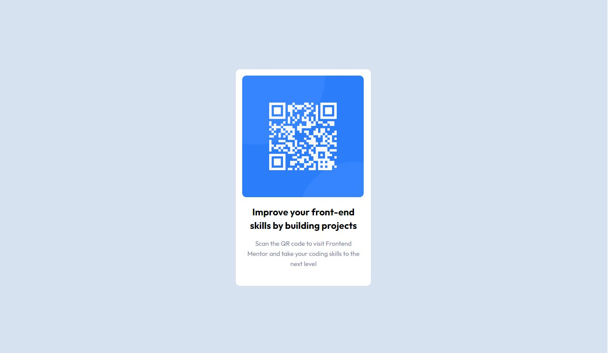

# Frontend Mentor - QR code component solution

This is a solution to the [QR code component challenge on Frontend Mentor](https://www.frontendmentor.io/challenges/qr-code-component-iux_sIO_H). Frontend Mentor challenges help you improve your coding skills by building realistic projects. 

## Table of contents

- [Frontend Mentor - QR code component solution](#frontend-mentor---qr-code-component-solution)
  - [Table of contents](#table-of-contents)
  - [Overview](#overview)
    - [Screenshot](#screenshot)
    - [Links](#links)
  - [My process](#my-process)
    - [Built with](#built-with)
    - [What I learned](#what-i-learned)
    - [Continued development](#continued-development)
  - [Author](#author)
  - [Acknowledgments](#acknowledgments)

## Overview
newbie Front End Mentor HTML/CSS challenge involving basic styling, positioning, responsiveness

### Screenshot

### Links

- Solution URL: (https://qr-code-challenge-jdhill.netlify.app/)

## My process

### Built with

- CSS custom properties
- Flexbox
- Mobile-first workflow
- media-queries

### What I learned

 Positioning and proportioning elements in CSS from a .jpeg can be a bit tricky. A fellow member on Front-end Mentor pointed out that I was using width instead of max-width. That was killing my responsiveness in flexbox. Ty @vcarames. The responsiveness seems decent Hopefully my proportions are closer this time.

### Continued development

revisit flexbox and mobile first RWD, CSS grid
## Author

- Website - [Jeffrey Hill](https://webdevhill.com/)
- Frontend Mentor - [Jeffrey Hill](https://www.frontendmentor.io/profile/webdevhill)

## Acknowledgments
- @vcarames - fellow user on Front end Mentor - Thank you!

